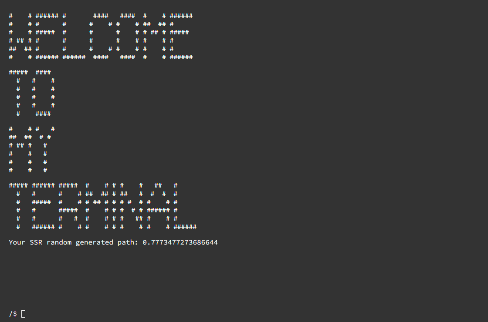

# Web Terminal Component

To install dependencies:

```bash
bun install
```

To run:

```bash
bun run app.js
```

This project was created using `bun init` in bun v1.0.2. [Bun](https://bun.sh) is a fast all-in-one JavaScript runtime.

## Roadmap

- [ ] Filesystem
    - [ ] Emulated in browser fs
    - [ ] Use usual fs which user allow access
    - [ ] Change `<terminal-path>` and all internal components to use `FileSystemDirectoryHandle`/`FileSystemFileHandle` instead of cringe `pathWithoutFsArray`, `fsPath` and `pathArray`
- [ ] General commands
    - [ ] cd
    - [ ] ls
    - [ ] cat
- [ ] In progress

## General questions

- Should we create emulated FS `createFileSystem({type:"emulated"})` inside `TerminalApp`, or we should get it from public API, or both ways?
  - The question is tricky because createFileSystem is async operation and seems like no way for it to be sync without tricky wrappers
- Should we have WASM API to include commands?
    - We will need example wasm command with an api
- Change component HTML tag from `<terminal-app>` to `<web-terminal>`?


## TODO:

-  [ ] Terminal Input
    -  [ ] change `this.#recalculateCursorOffset()` here and inside `ArrowUp` and `ArrowDown` cases
    -  [ ] not execute when user use `ctrl+c` to copy selected value
    -  [ ] proper history with save working draft
-  [ ] FileSystem
    -  [ ] think about how possible to return something but still be able to use await, so it will wait for FS to be
       ready. So we will have only `createFileSystem`
-  [ ] Commands
    - [ ] mkfs
        - [ ] add mkfs `${fsName}` usage, so it will be accessible through `cd /${fsName}`
        - [ ] Use `/local` as default value of `fsName`
    - [ ] ls
        - [ ] add command options
        - [ ] add work with `fileSystem`
    - [ ] commandsMap
        - [ ] make commands importable or not.
    - [ ] ExecutableCommand
        - [ ] add layer to execute by aliases
- [ ] Server part:
    - [ ] transfer all frontend deps to separate folder keeping w/o build development (mean transfer `node_modules` to
      frontend so serve `./frontend` not `./`)
- [ ] General:
  - [ ] Transfer `testParentComponent` and all needed for development to demo folder
- [ ] Tests: 
  - [ ] Write tests with `@web/test-runner`
- [ ] No ESLint Errors